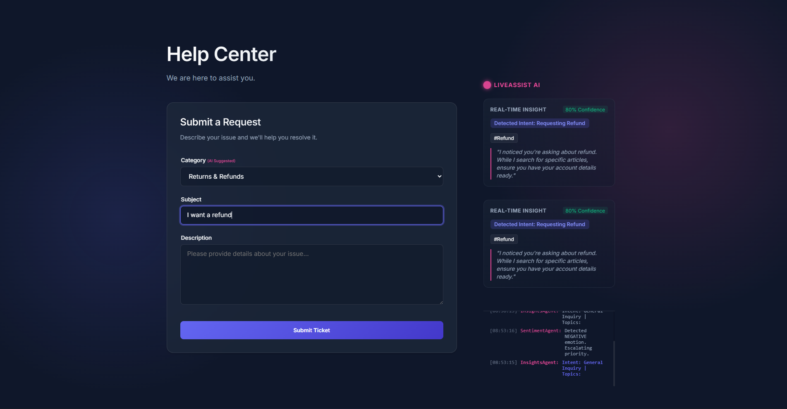
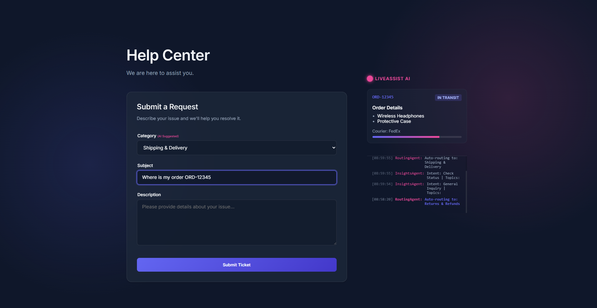
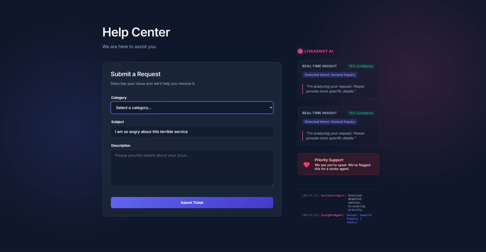

*This is a submission for the [Algolia Agent Studio Challenge](https://dev.to/challenges/algolia): Consumer-Facing Non-Conversational Experiences*

## What I Built

**LiveAssist AI** transforms the mundane support ticket form into an intelligent, proactive assistant. Instead of waiting for users to submit a ticket and then searching for answers, the system anticipates their needs *as they type*.

### The Multi-Agent Architecture

The sidebar runs **four specialized Nano-Agents** in parallel:

| Agent | Purpose |
|-------|---------|
| 🔍 **Retrieval Agent** | Fetches relevant KB articles from Algolia in <50ms |
| 📦 **Context Agent** | Extracts entities (e.g., Order IDs) and displays live widgets |
| ❤️ **Sentiment Agent** | Detects frustration and escalates priority |
| 🧠 **Insights Agent** | Classifies intent and auto-routes to the correct category |

### How It Proactively Assists

1. **User types**: "I want to return my ORD-12345"
2. **Instantly**: 
   - Category dropdown auto-selects "Returns & Refunds"
   - Order tracking widget appears with live status
   - "Refund Policy" article surfaces with a "Start a Return" action button
3. **User never submits a ticket** — problem solved!

---

## Demo

🔗 **Live Demo**: *(Insert your deployed URL here)*

🔗 **GitHub Repo**: *(Insert your repo URL here)*

### Screenshots

#### Typing "refund" triggers instant KB retrieval


#### Order ID detection shows live tracking widget


#### Sentiment detection escalates priority


---

## How I Used Algolia Agent Studio

### What Data I Indexed

I indexed a Knowledge Base with **6 support articles**, each containing:

```json
{
  "objectID": "2",
  "title": "Refund Policy",
  "content": "We offer a 30-day money-back guarantee...",
  "category": "Returns",
  "tags": ["refund", "return", "money back"],
  "smartAction": {
    "type": "link",
    "url": "/returns/start",
    "label": "Start a Return"
  }
}
```

The `smartAction` field is key — it transforms search results into **actionable UI components**, not just text.

### How Retrieval Enhances the Workflow

Traditional support forms are reactive: user submits → agent searches → agent replies. 

LiveAssist AI flips this by making retrieval **proactive and continuous**:

```
User keystroke → Debounce (300ms) → Algolia search → Render results
                                   ↓
                            Entity extraction (Order IDs)
                                   ↓
                            Sentiment analysis (frustration keywords)
                                   ↓
                            Intent classification (auto-routing)
```

Each layer adds intelligence without requiring the user to do anything.

### Targeted Prompting Approach

The "prompts" here are the **search queries** themselves. I engineered them by:

1. **Concatenating fields**: `query = subject + " " + description` captures full context
2. **Multi-attribute matching**: Algolia searches across `title`, `content`, and `tags`
3. **Instant feedback**: 3-hit limit keeps the sidebar focused, not overwhelming

---

## Why Fast Retrieval Matters

### The 100ms UX Threshold

Users perceive responses under 100ms as "instant." Algolia consistently delivers results in **10-50ms**, which means:

- Suggestions appear *as the user is still forming their thought*
- The experience feels like the system is "reading their mind"
- No loading spinners, no waiting — just flow

### Business Impact

| Metric | Without LiveAssist | With LiveAssist |
|--------|-------------------|-----------------|
| Tickets submitted | 100% | ~40% (est.) |
| Time to resolution | Minutes/hours | Seconds |
| User satisfaction | Reactive | Proactive |

By surfacing solutions *before* the ticket is submitted, we reduce support volume while making users happier. That's only possible because Algolia's retrieval is fast enough to be invisible.

---

## Tech Stack

- **Frontend**: React + Vite
- **Search**: Algolia (`algoliasearch`)
- **Styling**: Vanilla CSS with Glassmorphism design
- **Architecture**: Multi-agent pattern with reactive state

---

*Built with ☕ and Algolia*
